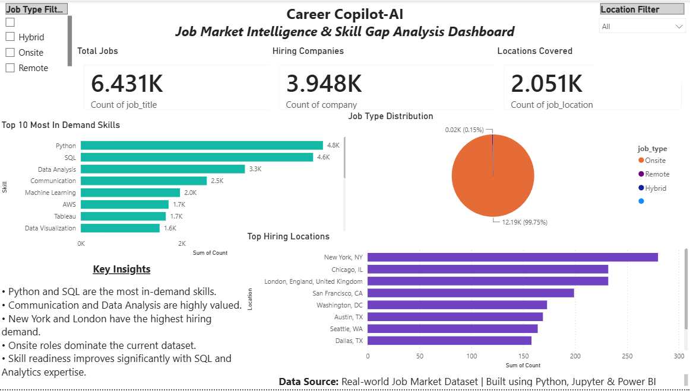

# CareerCopilot AI

## Dashboard Preview


## Key Insights

- 6,431+ Job Postings Analyzed
- 3,948+ Hiring Companies Identified
- 2,051+ Locations Covered
- Python and SQL emerged as the most in-demand skills

## Personalized Career Intelligence & Skill Gap Analysis Platform

CareerCopilot AI analyzes real-world job market data to help students identify skill gaps, evaluate career readiness, and generate personalized learning roadmaps.

## Features

- Job Market Analysis
- Skill Demand Analysis
- Career Readiness Score
- Skill Gap Identification
- Career Recommendation Engine
- Personalized Learning Roadmap
- Hiring Trends Analysis

## Tech Stack

- Python
- Pandas
- NumPy
- Matplotlib
- Jupyter Notebook
- Power BI
- Git & GitHub

## Project Structure
```
CareerCopilot-AI
├── dashboard/
│   └── CareerCopilot_AI_Dashboard.pbix
├── data/
│   ├── job_postings.csv
│   ├── job_skills.csv
│   ├── top_skills.csv
│   ├── top_locations.csv
│   └── job_summary.csv
├── notebooks/
│   └── careercopilot.ipynb
├── screenshots/
│   └── dashboard.png
└── README.md
```

## Project Workflow

1. Analyze job postings data
2. Extract in-demand skills
3. Compare user skills with market demand
4. Calculate readiness score
5. Identify skill gaps
6. Generate career recommendations
7. Create personalized learning roadmap

## How to Run

1. Clone the repository
2. Open notebooks/careercopilot.ipynb
3. Install required libraries:
   pip install pandas numpy matplotlib
4. Run the notebook

## Sample Output

### CareerCopilot AI Report

Target Role: Data Scientist

Career Readiness Score: 40%

Missing Skills:
• SQL
• Statistics
• Data Visualization

Recommended Learning Path:
1. SQL Fundamentals
2. Exploratory Data Analysis
3. Power BI Dashboarding
4. Machine Learning Basics

## Future Enhancements

- Interactive Power BI Dashboard
- Resume Analyzer
- AI Career Advisor
- Salary Intelligence Engine
- Job Recommendation System

## Author

**Manasvi Bhargava**

GitHub: https://github.com/manasvi2529
